---
categories:
- Travel
date: '2017-04-29'
featured_image: posts/2017/edinburgh/http://www.edinburghexpert.com/blog/arthurs-seat-and-edinburghs-volcanoes).
slug: edinburgh
tags:
- Europe
- UK
- Scotland
- Edinburgh
title: Edinburgh
---

After getting off the ferry we had a nice coastal drive on the bus to Edinburgh, briefly stopping at Glasgow on the way.
Edinburgh is a really cool looking city, with lots of nice buildings.

We went to our airBnB which overlooked Arthur's Seat and was hosted by a really nice guy Russell, who told us that the layers actually inspired the theory of [tectonic plates](http://www.edinburghexpert.com/blog/arthurs-seat-and-edinburghs-volcanoes).

The next morning we did the free walking tour and had an awesome guide, Sabela. We got to see some multi-level architecture, with buildings that have either 4 or 11 floors depending which side you go to because it's so hilly. We saw some alleys, which are called a Close (because the builds are so close). We played the game Local or Tourist, where you watch people walk past the [Heart of Midlothian](https://en.wikipedia.org/wiki/Heart_of_Midlothian_%28Royal_Mile%29) and see if they sidestep and spit on it or stop to look at the pretty love heart. We heard of [Deacon Brodie](https://en.wikipedia.org/wiki/William_Brodie) who was a keymaker by day who robbed his clients by night and [half-hangit Maggie](https://en.wikipedia.org/wiki/Grassmarket#As_a_place_of_execution). Rachael's favorite story was about the guys who stole [The Stone of Destiny](https://en.wikipedia.org/wiki/Stone_of_Scone#Removal_and_damage) - which we saw later at the castle.

We learnt about how the church taught people to read the bible and learning to read brought about the [Scottish Enlightenment](https://en.wikipedia.org/wiki/Scottish_Enlightenment) which brought about a whole bunch of philosophers like David Hume who was the first to promote the idea that you could have morals without religion. Since Edinburgh had all these philosophers they wanted to become Athens of the North and so built their own Parthenon at [Calton Hill](https://en.wikipedia.org/wiki/Calton_Hill).

We visited [Greyfriars Kirkyard](https://en.wikipedia.org/wiki/Greyfriars_Kirkyard) which is a cemetery behind the cafe where J.K. Some of the people buried there include Thomas Riddle, a McGonagall and a Pettigrew.

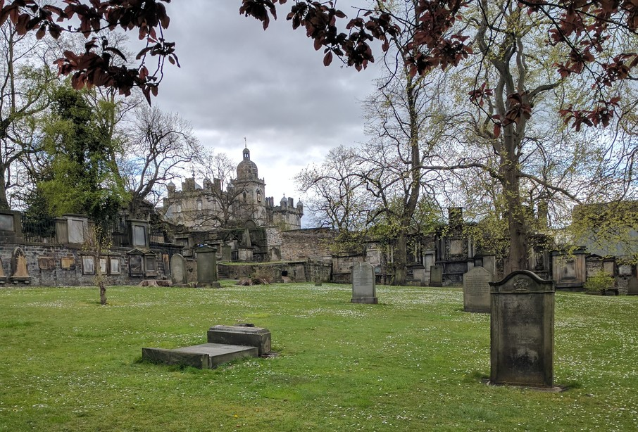

There was also a grave for Gregyfriars Bobby, which was a dog that guarded the grave of its owner for 14 years after he died, which reminded me of the Futurama episode Jurrasic Bark.

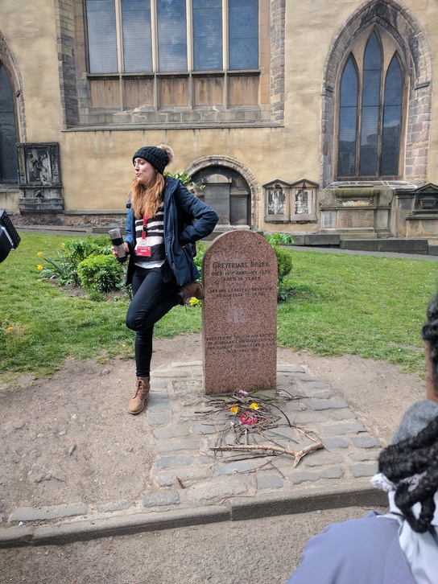

After our tour we doubled back to St Giles' Cathedral and the [Thistle Chapel](https://en.wikipedia.org/wiki/St_Giles%27_Cathedral#Thistle_Chapel), which is inside the cathedral but not part of it, and is where the Scottish knights meet once a year and was pretty interesting to learn about.

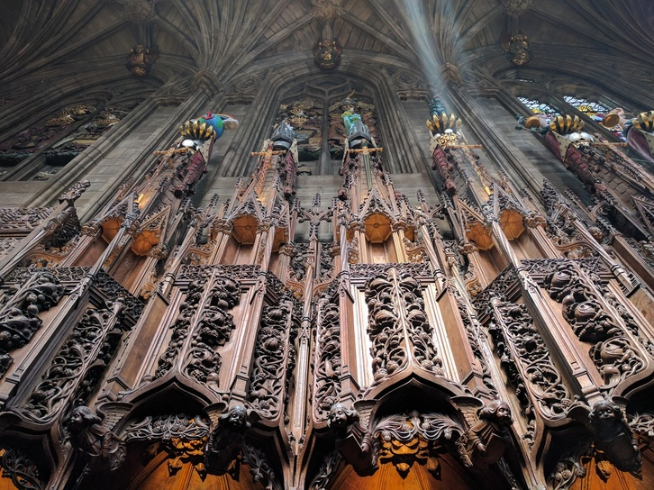

We then did a tour of Edinburgh Castle which had great views of the city, lots of cool rooms, and the crown jewels.

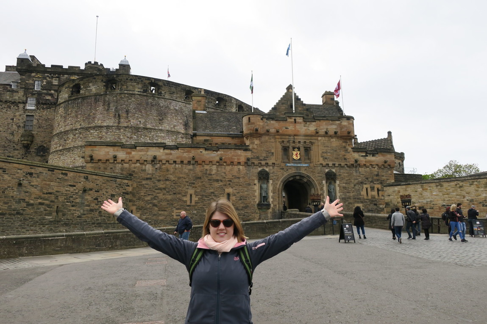

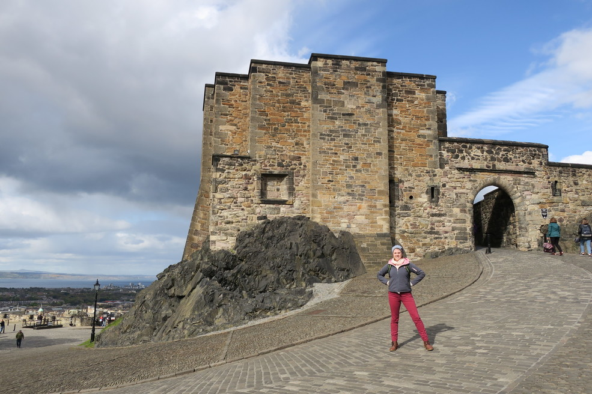

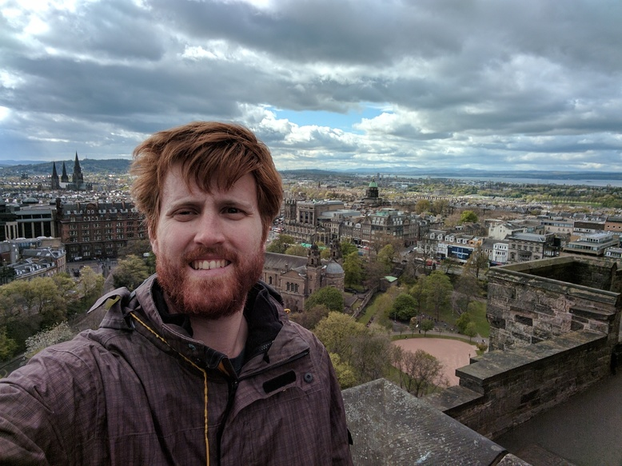

We also saw the hall where the actual red wedding took place.

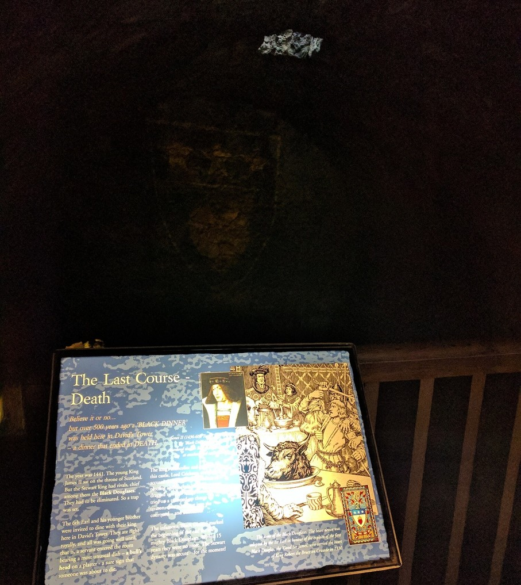

The next day we went to the National Museum of Scotland, which was pretty good.

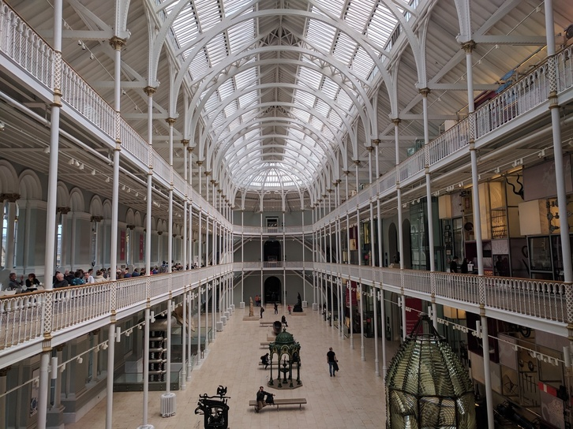

They had a display on all the extinct animals which was interesting because they were all mostly from Australia or New Zealand. I guess they killed off everything in Europe before they had a chance to name all the species.
They also had a cool exhibit on communication history (telegraph, ocean internet cables) and a pretty good power and energy display. And they had Dolly the Sheep.

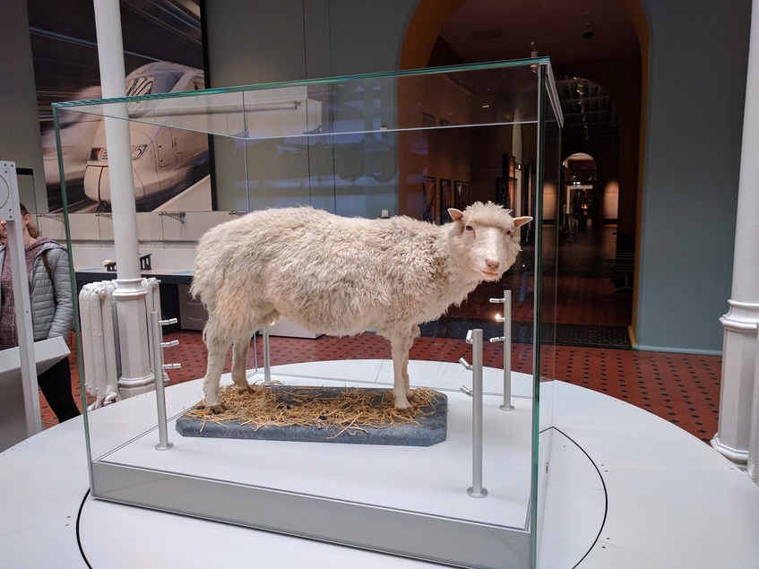

In the afternoon we walked up to see the Athens of the North.

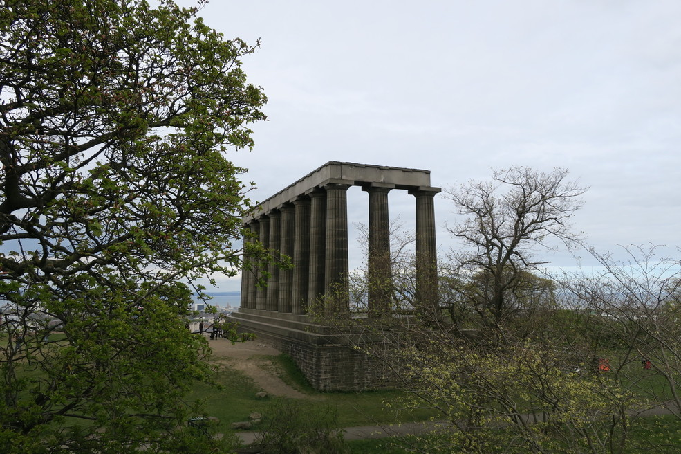

And then we climbed Arthur's seat, which had spectacular views and was a great little hike. We also saw our first pheasant.

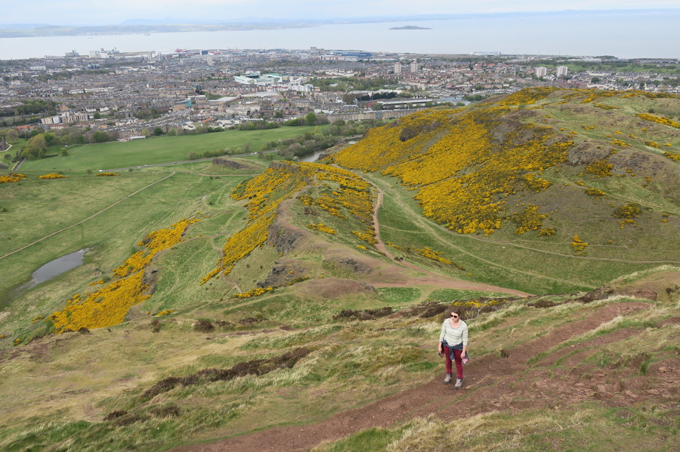

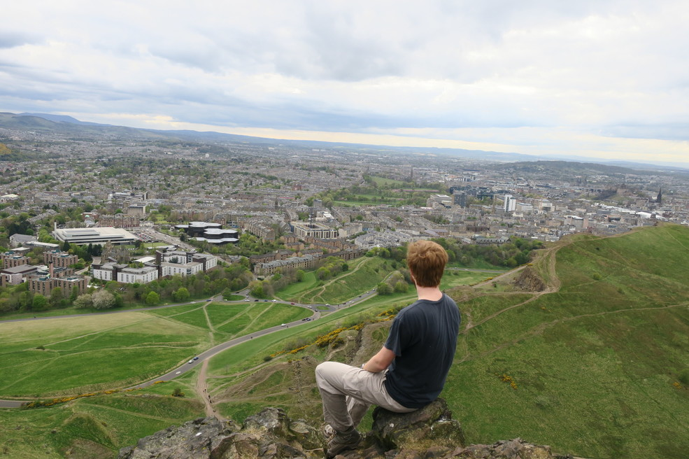