---
categories:
- Travel
date: '2020-11-04'
slug: cania-gorge
title: Cania Gorge
featured_image: posts/2020/cania-gorge/fern-tree2.jpg
tags:
- Queensland
- Hiking
---

After checking in at the caravan park, we decided to do the short Shamrock mine walk first. There were a bunch of holes in the ground including an open pit that you could look down which was pretty cool.

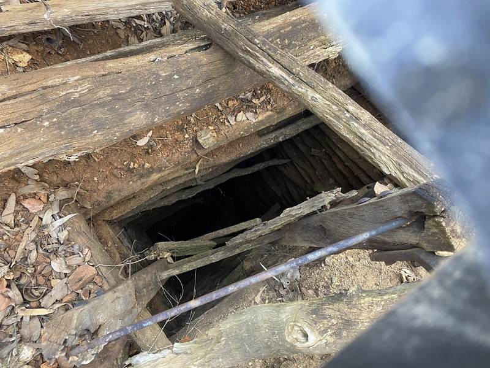

From here you can also see Castle Mountain Lookout, which we didn't attempt (as it's a 22km walk) but would be a good view if you had more time.

After a quick look at the lake, we went back to the caravan park. Lyra really enjoyed the water park even though the water was still pretty cold. They had bird feeding every afternoon which was pretty hectic and meant that all the animals were pretty used to people.

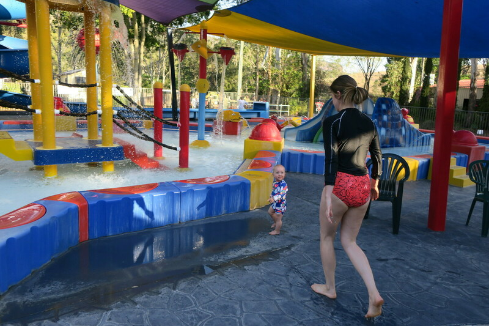
 King Parrot wanted my lunch")
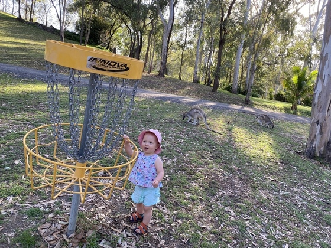

The next day we did most of the hikes. Big Foot Walk is a really short one from the carpark, so we started with it.

From there we climbed up to Giant's Chair Lookout, which is the opposite direction to what was recommended but Mark didn't want to do the full walk. It had nice views of the cliffs on the other side of the Gorge which we would hike in the afternoon.

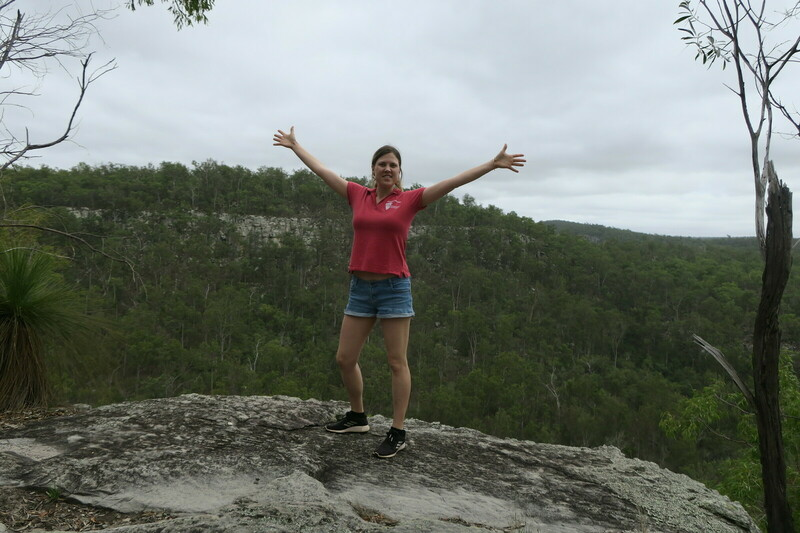

After the lookout it's a long, but mostly downhill, walk to see Fern Tree Pool and walk back through Doctor's Gully.

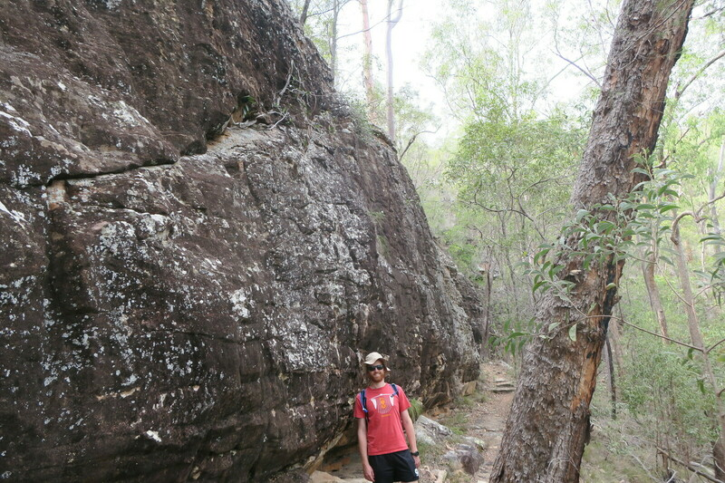
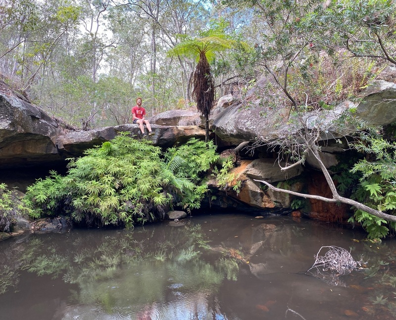
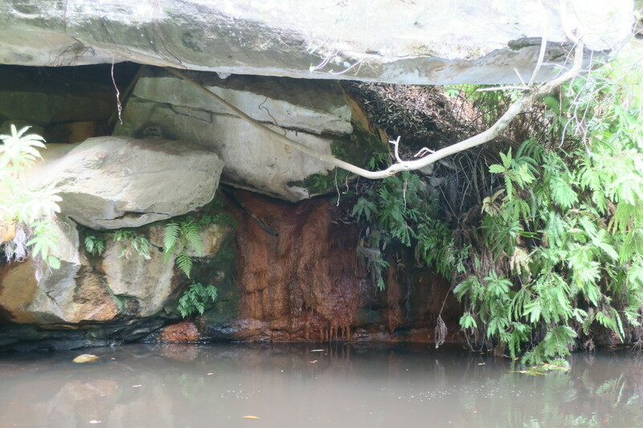

From the main picnic area, Two Storey Cave Walk was another short walk we did before lunch. The 2nd "Storey" of the cave is home to some bats (which we didn't see but could smell).

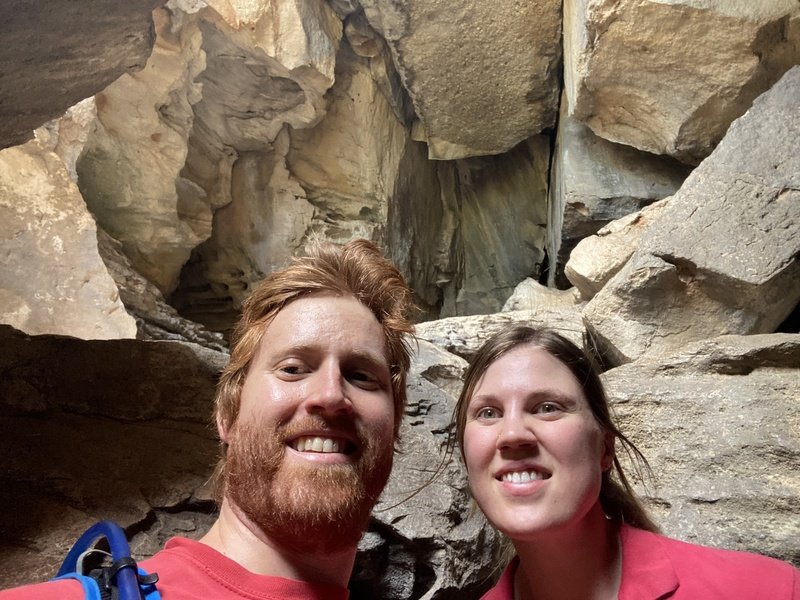

The much more impressive part of that walk was the King Orchid Crevice, which was also covered in elkhorn ferns.

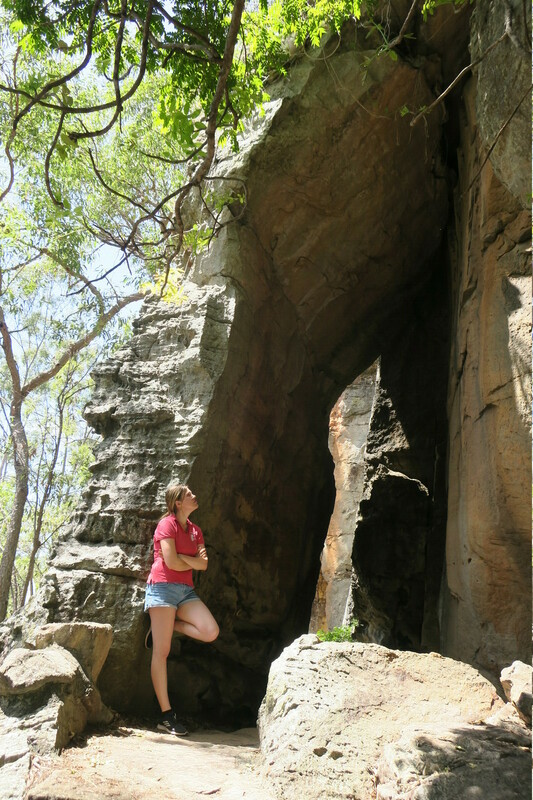
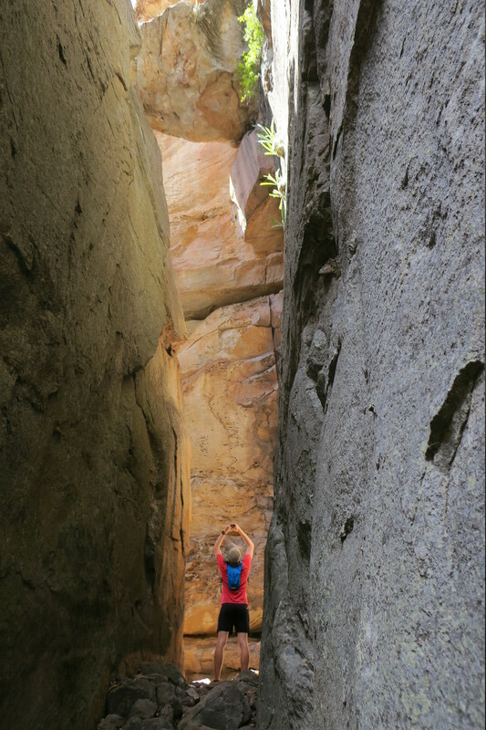
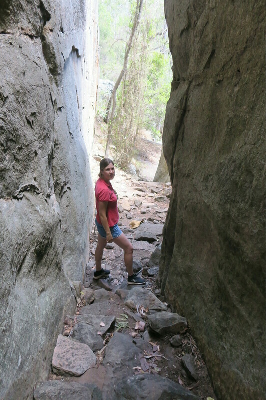

After lunch we did The Dripping Rock and The Overhang Walk, which was definitely the highlight. It was pretty similar to Carnarvon - it even had aboriginal hand art. Everything was pretty green, but despite recent rain there wasn't much water.

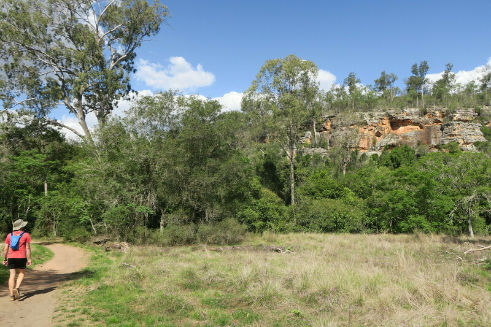

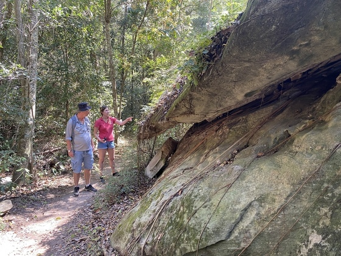
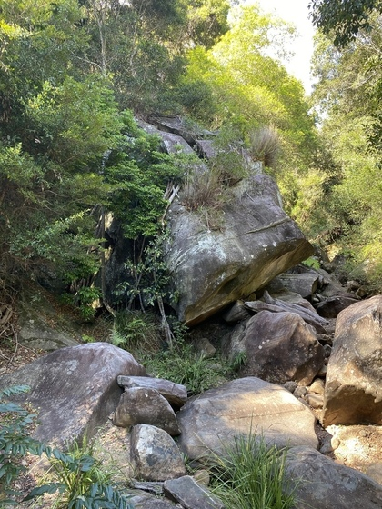

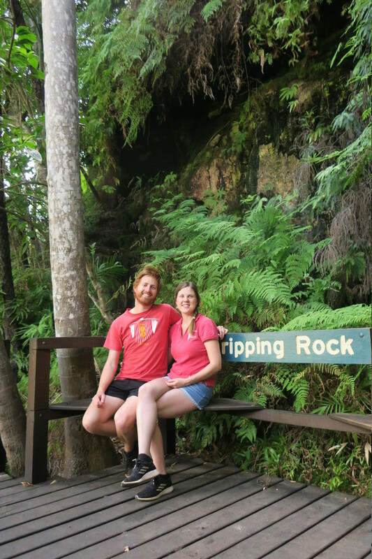

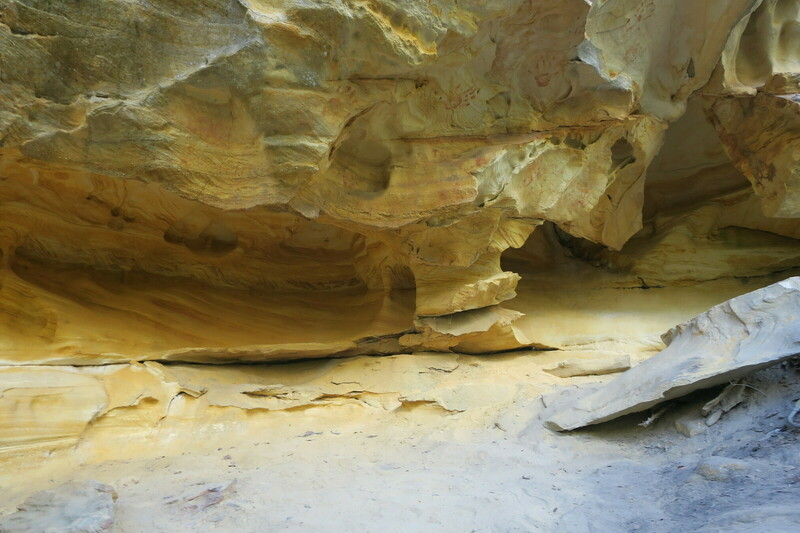
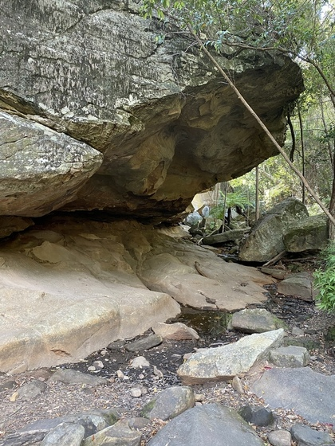
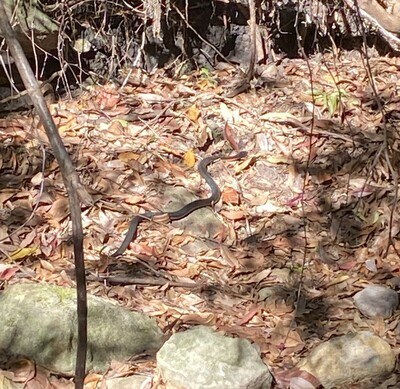

There was another offshot to see Dragon Cave and Bloodwood Cave. Dragon Cave was pretty nice, but Bloodwood Cave wasn't particularly exciting. The bloodwood tree roots coming through the rock that it's named after were kind of impressive.

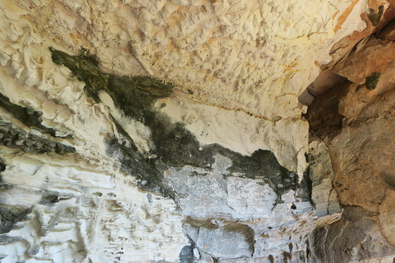

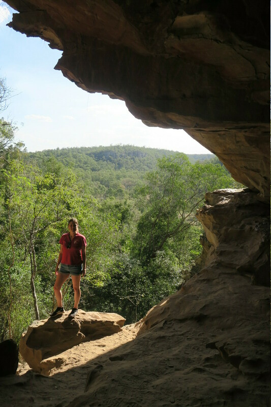

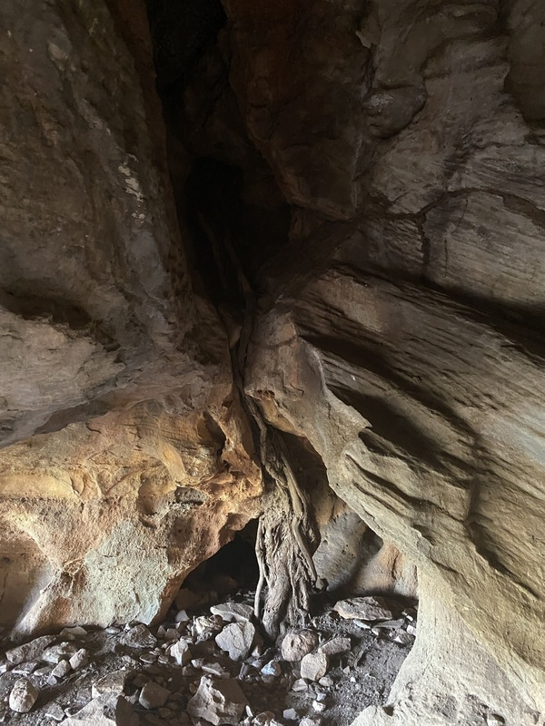

From here you could also go up to another lookout before the start of the Castle Mountain Lookout walk. There had been some backburning or fire up the top but it still offered a nice view back towards the Giant's Chair Lookout that we had done in the morning.

Overall, Cania wasn't as enjoyable as Carnarvon - but it's much easier to get to and still well worth a visit.
